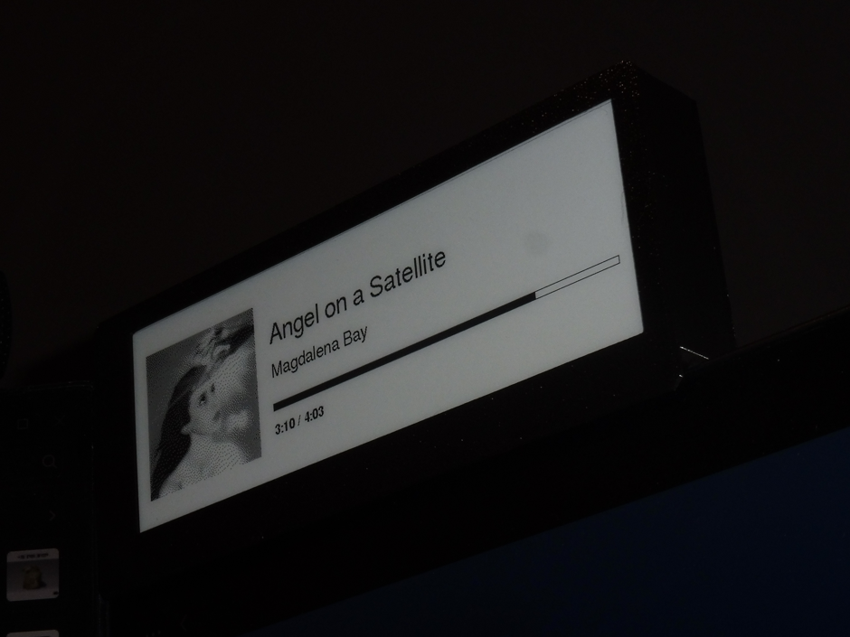
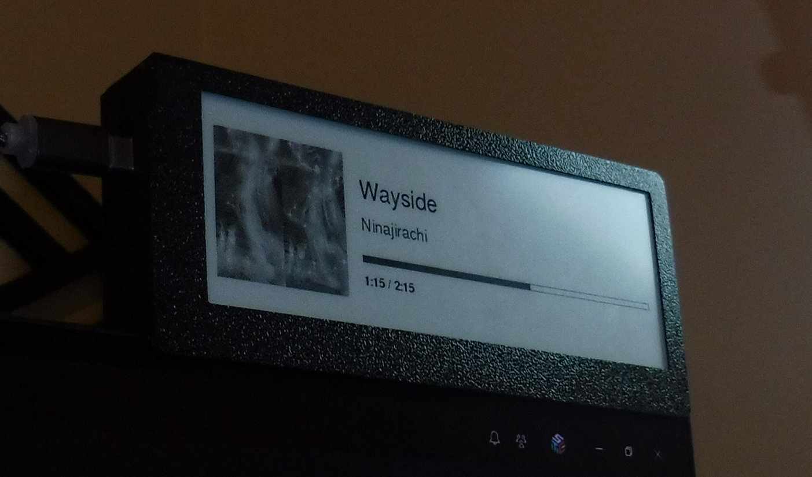
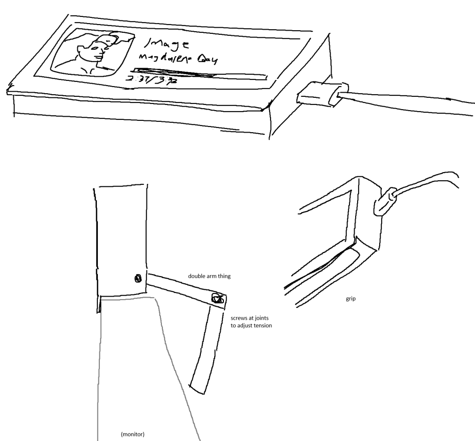
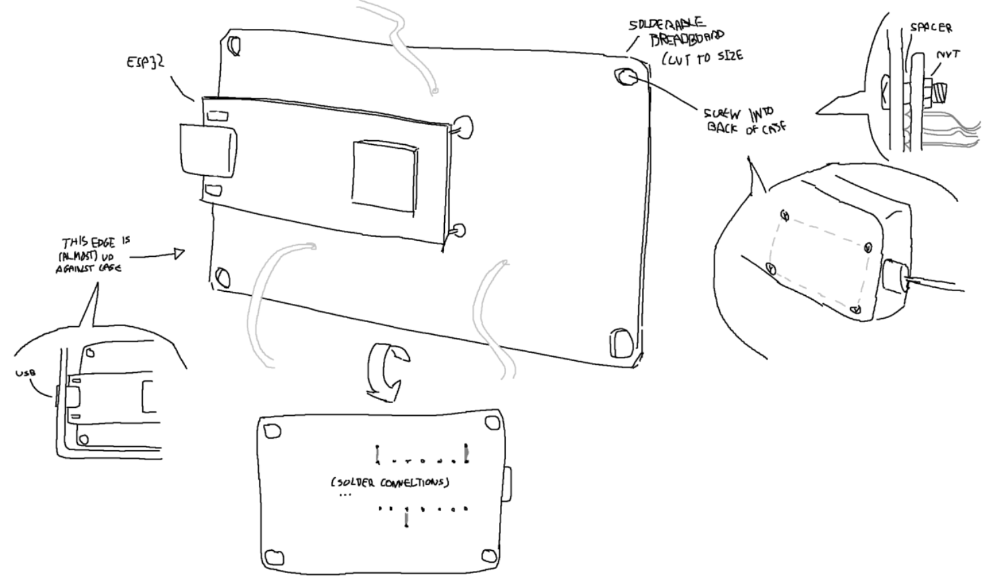
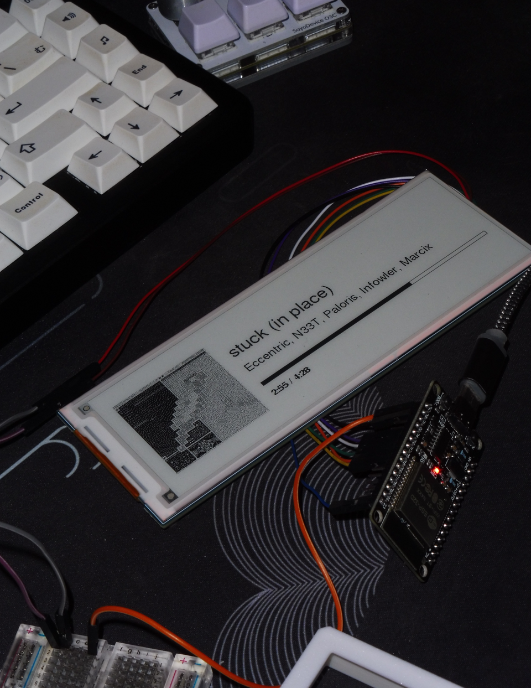
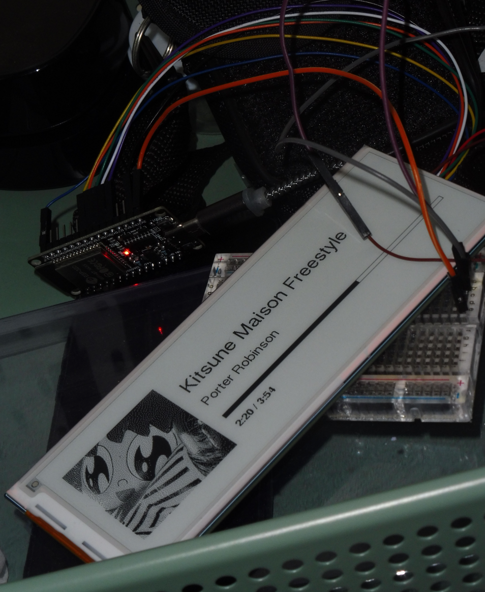
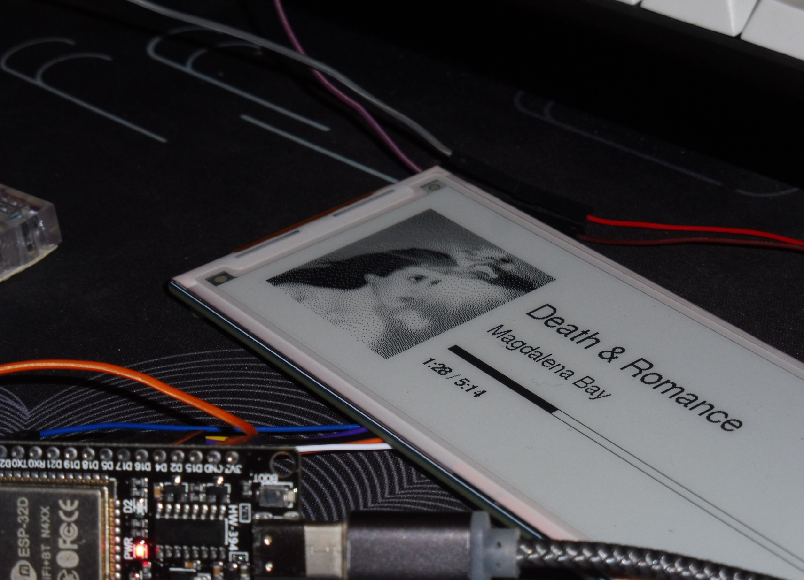

# spotify display

This is a mini E-Ink screen powered by an ESP-32 through USB-C that displays what you are listening to on Spotify, live. It uses a Python script that sends periodic messages over serial, triggering full and partial display refreshes depending on activity (song change, playback status, timestamp, etc.).

The screen displays the song title, artist names, the point in the song the playback is currently at, updating roughly every 2 seconds, as well as a (stylish!!) dithered conversion of the album art due to the limitations of the Waveshare 5.79" E-Ink module.

## process

This was a very foreign project to me, so it really was just a lot of messing around with random stuff until something happened that nudged me in the right direction. I already had a bit of prior experience with the Spotify API when developing another project of mine (matchify :v), so that part wasn't as difficult, but trying to send over that information to the ESP-32 was confusing. After some reading, I eventually ended up sending some test messages over a serial port, which (after minor troubleshooting) ended up working incredibly well. 

This success was extremely short-lived as I realised how insanely slow the serial was when dealing with images (or binary representations of them). Such relatively large data slowed down the updates to a crawl, and it was probably the biggest hitch in the process of this project. In the end, I realised that simply sending all that image stuff in a separate serial message would fix all my issues. I also anticipated that handling and converting the image would be difficult, but thanks to the Pillow library, the dithering was incredibly trivial.

The UI 'design' was fortunately straightforward. While it was a huge pain setting up the library required for my specific model of display, it was really satisfying understanding it and eventually getting everything working.

 

Inbetween struggling to write the code for this, I worked on the housing for the display using Onshape (I should probably learn Fusion considering it's free for students lol). Man I suck at CAD. This went through more iterations than I'd like to admit, simply due to my inability to visualise EVEN with a pair of callipers on hand. It's genuinely embarrassing.

This version of the housing I'm using right now isn't even that good. I just gave up wasting filament. Maybe I'll come back after a bit and design something much better and more functional, but for the time being, this works well enough.

## yap or lore or whatever

A month ago, I overheard a friend of mine talking about something to do with 'embedded'. I didn't know what that term meant at the time, but the way it was described sounded pretty cool to me, and I knew I wanted to create something - anything - of that sort. I looked into it some more and realised that this Spotify Display idea I had was kind of similar in nature to the stuff I did as a 10-11 year old in my primary school's STEM club, which was a pretty cool callback. Instead of using the Arduino UNO, I'd be using the WROOM-32 ESP-32, both using C++.

With the Data Structures and Algorithms subject scheduled for next semester (Autumn 2026), I decided I'd also take this opportunity to get familiar with some C++. What I did for this embedded project probably didn't help as much, but the  stuff I did outside of it during this period of time was pretty fun and eye-opening. 

I also ended up buying a Bambu Lab A1 Mini during this project just for the housing. Initially, I wanted to use my friend's printer (with compensation!), but in retrospect, I'm glad I didn't torture him with the number of terrible versions I printed.

A different friend also suggested turning this into an actual product that people can buy for themselves.. something to think about if I get around to refining this. The code and everything is probably pretty terrible lolol

## drawings

I love making silly drawings as drafts and concepts for my projects or anything I work on. Despite how inaccurate they are now, I think the ones for this project are pretty cool :p

almost unintelligible first concepts, some drawings from trying to figure out the housing

 

## future improvements

Despite how simple this project is, there are so many ways it could be better and is FAR from perfect. This project is in a pretty stable and 'good enough' state at the moment, but if I ever come back to refine it, here's what I would do.
- Add text wrapping for longer titles (and long artist names)
- Emulate 1 second updates to the timestamp so it looks more responsive
- Improve housing

 
 

Oh yeah also here are some images I took when I got the innards working that I think are pretty cool.

